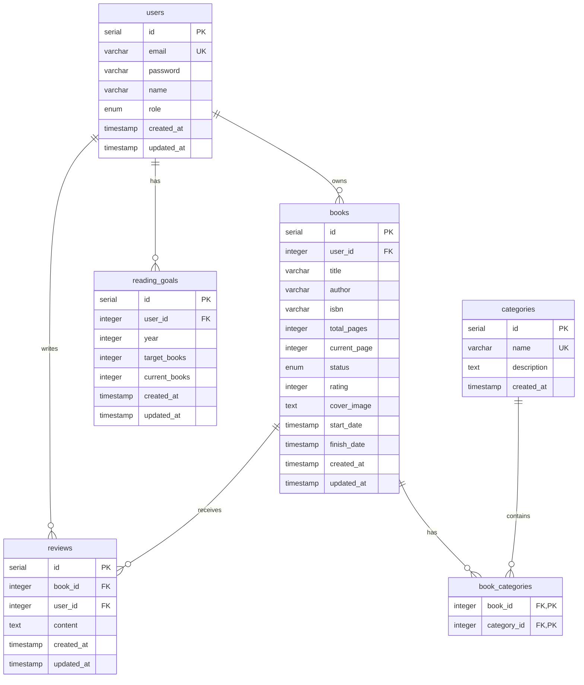

# Entity Relationship Diagram (ERD)

## Database Schema Overview

Aplikacja BookTracker wykorzystuje 6 tabel w bazie danych PostgreSQL:

### Diagram ERD



## Szczegółowy opis tabel

### 1. users
Tabela przechowująca dane użytkowników systemu.

**Kolumny:**
- `id` (serial, PK) - Unikalny identyfikator użytkownika
- `email` (varchar(255), UNIQUE) - Adres email użytkownika (login)
- `password` (varchar(255)) - Zahashowane hasło (bcrypt)
- `name` (varchar(255)) - Imię i nazwisko użytkownika
- `role` (enum) - Rola użytkownika: 'user' lub 'admin'
- `created_at` (timestamp) - Data utworzenia konta
- `updated_at` (timestamp) - Data ostatniej aktualizacji

**Relacje:**
- One-to-Many z `books`
- One-to-Many z `reviews`
- One-to-Many z `reading_goals`

### 2. books
Tabela przechowująca książki użytkowników.

**Kolumny:**
- `id` (serial, PK) - Unikalny identyfikator książki
- `user_id` (integer, FK) - ID właściciela książki
- `title` (varchar(255)) - Tytuł książki
- `author` (varchar(255)) - Autor książki
- `isbn` (varchar(20), nullable) - Numer ISBN
- `total_pages` (integer) - Całkowita liczba stron
- `current_page` (integer) - Aktualna strona (postęp czytania)
- `status` (enum) - Status: 'to_read', 'reading', 'completed', 'abandoned'
- `rating` (integer, nullable) - Ocena 1-5
- `cover_image` (text, nullable) - URL okładki
- `start_date` (timestamp, nullable) - Data rozpoczęcia czytania
- `finish_date` (timestamp, nullable) - Data ukończenia
- `created_at` (timestamp) - Data dodania
- `updated_at` (timestamp) - Data ostatniej aktualizacji

**Relacje:**
- Many-to-One z `users`
- Many-to-Many z `categories` (przez `book_categories`)
- One-to-Many z `reviews`

### 3. categories
Tabela z kategoriami/gatunkami książek.

**Kolumny:**
- `id` (serial, PK) - Unikalny identyfikator kategorii
- `name` (varchar(100), UNIQUE) - Nazwa kategorii
- `description` (text, nullable) - Opis kategorii
- `created_at` (timestamp) - Data utworzenia

**Relacje:**
- Many-to-Many z `books` (przez `book_categories`)

### 4. book_categories
Tabela łącząca (junction table) dla relacji Many-to-Many między książkami a kategoriami.

**Kolumny:**
- `book_id` (integer, FK, PK) - ID książki
- `category_id` (integer, FK, PK) - ID kategorii

**Klucz główny:** Złożony z `book_id` i `category_id`

### 5. reviews
Tabela z recenzjami książek.

**Kolumny:**
- `id` (serial, PK) - Unikalny identyfikator recenzji
- `book_id` (integer, FK) - ID książki
- `user_id` (integer, FK) - ID autora recenzji
- `content` (text) - Treść recenzji
- `created_at` (timestamp) - Data utworzenia
- `updated_at` (timestamp) - Data ostatniej aktualizacji

**Ograniczenia:**
- Unique constraint na `(book_id, user_id)` - jeden użytkownik może dodać tylko jedną recenzję do książki

**Relacje:**
- Many-to-One z `books`
- Many-to-One z `users`

### 6. reading_goals
Tabela z celami czytelnymi użytkowników.

**Kolumny:**
- `id` (serial, PK) - Unikalny identyfikator celu
- `user_id` (integer, FK) - ID użytkownika
- `year` (integer) - Rok, którego dotyczy cel
- `target_books` (integer) - Docelowa liczba książek do przeczytania
- `current_books` (integer) - Aktualnie przeczytane książki
- `created_at` (timestamp) - Data utworzenia
- `updated_at` (timestamp) - Data ostatniej aktualizacji

**Ograniczenia:**
- Unique constraint na `(user_id, year)` - jeden użytkownik może mieć tylko jeden cel rocznie

**Relacje:**
- Many-to-One z `users`

## Normalizacja (3NF)

Baza danych spełnia wymogi trzeciej postaci normalnej (3NF):

### 1NF (Pierwsza Postać Normalna)
- Wszystkie atrybuty są atomowe (niepodzielne)
- Każda tabela ma klucz główny
- Brak powtarzających się grup danych

### 2NF (Druga Postać Normalna)
- Spełnia 1NF
- Wszystkie atrybuty niekluczowe są w pełni zależne od całego klucza głównego
- W tabelach z kluczem złożonym (`book_categories`) oba klucze są niezbędne do jednoznacznej identyfikacji rekordu

### 3NF (Trzecia Postać Normalna)
- Spełnia 2NF
- Brak przechodnich zależności funkcyjnych
- Przykłady:
  - Informacje o użytkowniku są w tabeli `users`, nie są duplikowane w `books`
  - Informacje o kategorii są w tabeli `categories`, nie w `books`
  - Relacje many-to-many są obsługiwane przez dedykowaną tabelę łączącą (`book_categories`)

## Indeksy

Zalecane indeksy dla optymalizacji wydajności:

```sql
-- users
CREATE INDEX idx_users_email ON users(email);

-- books
CREATE INDEX idx_books_user_id ON books(user_id);
CREATE INDEX idx_books_status ON books(status);
CREATE INDEX idx_books_user_status ON books(user_id, status);

-- book_categories
CREATE INDEX idx_book_categories_book ON book_categories(book_id);
CREATE INDEX idx_book_categories_category ON book_categories(category_id);

-- reviews
CREATE INDEX idx_reviews_book ON reviews(book_id);
CREATE INDEX idx_reviews_user ON reviews(user_id);

-- reading_goals
CREATE INDEX idx_reading_goals_user ON reading_goals(user_id);
CREATE INDEX idx_reading_goals_year ON reading_goals(year);
```

## Kaskadowe usuwanie

Relacje z CASCADE DELETE:
- Usunięcie użytkownika usuwa wszystkie jego książki, recenzje i cele
- Usunięcie książki usuwa wszystkie jej relacje z kategoriami i recenzje
- Usunięcie kategorii usuwa tylko relacje w `book_categories`, nie książki